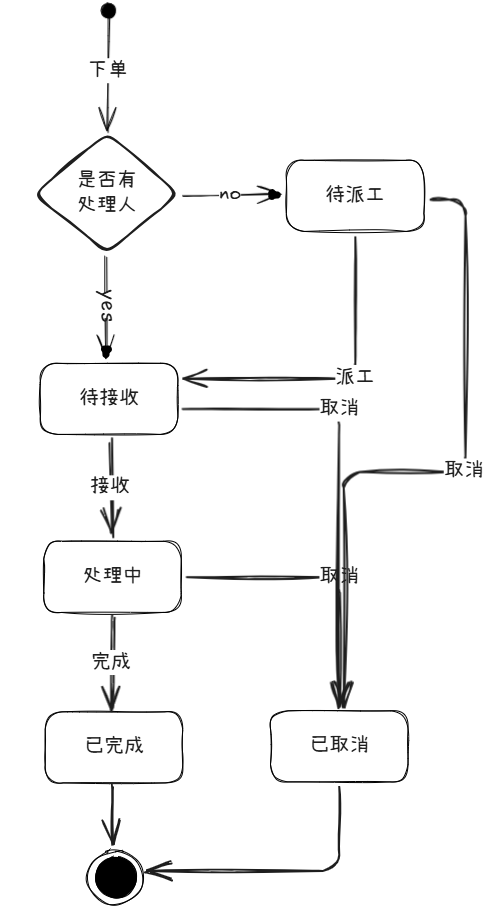

# spring statemachine 实战学习

### 使用技术
使用spring boot 3.x，spring statemachine，mybatis-plus，实现工单系统状态流转。

### 运行环境
##### 1）
##### 2）
##### 3）

### 状态图

### 参考博客
[spring statemachine 官方文档](https://docs.spring.io/spring-statemachine/docs/4.0.0/reference/)

[wphmoon/statemachine](https://gitee.com/wphmoon/statemachine)

